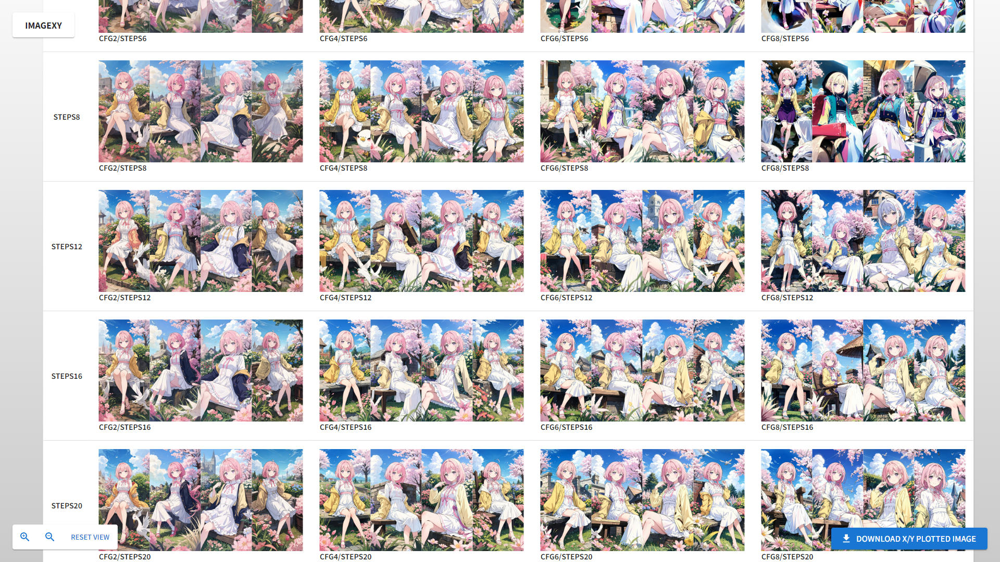

# ImageXY

This is a web application that displays images generated by a generative AI, such as Stable Diffusion, on an X/Y plot.
This web application is deployed on Vercel. Please open the following URL.

https://imagexy.vercel.app/

## Screenshots



## How to use it

This application requires multiple image files named in a specific format.
The file name format is as follows:

```
[x_label]_[y_label]_[index].[extension]
```

**x_label**

This is a horizontal label for an X/Y plot, such as `cfg2` or `cfg4`.

**y_label**

This is a vertical label for an X/Y plot, such as `steps2` or `steps4`.

**index**

This is a display order parameter. For example, it could be "0001" or "0004".

**extension**

This is a image file extension, such as `png` or `jpeg`.

The sample files that this application can load are stored in the following directory.

[Sample Image Files](docs/images/samples/)

Please drag and drop image files onto the drop zone area. Dropped files will be plotted on the X/Y axis.

## How to generate files using ComfyUI

You can generate multiple image files required for X/Y plots using the [ComfyUI](https://github.com/comfyanonymous/ComfyUI) API.
The steps to execute the API are as follows.

- Create a ComfyUI workflow.
- Open ComfyUI config and enable **developer mode**.
- Click **[Save (API Format)]** to download the `workflow_api.json` file.
- Write a Python script and execute the API. The sample code is as follows:

```python
import json
from urllib import request
import itertools


def main():
    with open("workflow_api.json", encoding="utf-8") as f:
        prompt_text = f.read()

    prompt = json.loads(prompt_text)

    x_label = "cfg"
    y_label = "steps"

    xx = [2, 4, 6, 8]
    yy = [1, 2, 4, 6, 8, 12, 16, 20]

    for params in itertools.product(xx, yy):
        x = params[0]
        y = params[1]

        prompt["<<<ksampler_node_id>>>"]["inputs"]["cfg"] = x
        prompt["<<<ksampler_node_id>>>"]["inputs"]["steps"] = y
        prompt["<<<save_image_node_id>>>"]["inputs"]["filename_prefix"] = x_label + str(x) + "_" + y_label + str(y)

        request.urlopen(
            request.Request(
                "http://127.0.0.1:8188/prompt",
                data=json.dumps({"prompt": prompt}).encode("utf-8"),
            )
        )


if __name__ == "__main__":
    main()
```

The sample script files are located in the **[scripts](./scripts)** directory.

The official sample code URL is as follows.

https://github.com/comfyanonymous/ComfyUI/blob/master/script_examples/basic_api_example.py
